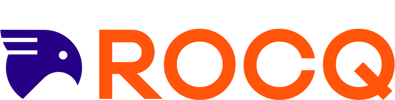

<p align="center">
  
</p>

<p align="center">
  <a href="https://hacspec.zulipchat.com/"></a>
  <a href="https://hax-playground.cryspen.com"></a>
  <a href="https://hax.cryspen.com"></a>
  <a href="https://hax.cryspen.com/blog"></a>
  <a href="LICENSE"></a>
</p>

# hax

hax is a tool for high assurance translations of a large subset of
Rust into formal languages such as [Lean](https://lean-lang.org/),
[F\*](https://www.fstar-lang.org/) or [Rocq](https://rocq-prover.org/).

<p align="center">
    <a href="https://hax-playground.cryspen.com/#fstar+tc/latest-main/gist=5252f86237adbca7fdeb7a8fea0b1648">
    Try out hax online now!
    </a>
</p>

### Supported Backends

<table align="center">
  <tr>
    <td align="center" colspan="3">
      General purpose proof assistants
    </td>
    <td align="center" colspan="2">
      Cryptography & protocols
    </td>
  </tr>
  <tr>
    <td align="center">
      <a href="https://lean-lang.org/">
        <picture>
          <source srcset=".github/assets/lean-dark.svg" media="(prefers-color-scheme: dark)">
          <source srcset=".github/assets/lean-light.svg" media="(prefers-color-scheme: light)">
          
        </picture>
        <br><sub>(via Aeneas)</sub>
      </a>
    </td>
    <td align="center">
      <a href="https://www.fstar-lang.org/">
        F*
      </a>
    </td>
    <td align="center">
      <a href="https://rocq-prover.org/">
        <picture>
          <source srcset=".github/assets/rocq-dark.svg" media="(prefers-color-scheme: dark)">
          <source srcset=".github/assets/rocq-light.svg" media="(prefers-color-scheme: light)">
          
        </picture>
      </a>
    </td>
    <td align="center">
      <a href="https://github.com/SSProve/ssprove">
        <picture>
          <source srcset=".github/assets/ssprove-dark.svg" media="(prefers-color-scheme: dark)">
          <source srcset=".github/assets/ssprove-light.svg" media="(prefers-color-scheme: light)">
          
        </picture>
      </a>
    </td>
    <td align="center">
      <a href="https://proverif.inria.fr/">
        <b>ProVerif</b>
      </a>
    </td>
  </tr>
  <tr>
    <!-- 🟢🟡🟠🔴 -->
    <td align="center"><sub>🚀 active dev.</sub></td>
    <td align="center"><sub>🟢 stable</sub></td>
    <td align="center"><sub>🟡 partial</sub></td>
    <td align="center"><sub>🟡 partial</sub></td>
    <td align="center"><sub>🟠 PoC</sub></td>
  </tr>
</table>

## Learn more

Here are some resources for learning more about hax:

 - [Manual](https://hax.cryspen.com/manual/index.html) (work in progress)
    + Quick start: [Lean](https://hax.cryspen.com/manual/lean/quick_start/), [F*](https://hax.cryspen.com/manual/fstar/quick_start/)
    + Tutorial: [Lean](https://hax.cryspen.com/manual/lean/tutorial/), [F*](https://hax.cryspen.com/manual/fstar/tutorial/)
 - [Examples](./examples/): the [examples directory](./examples/) contains
   a set of examples that show what hax can do for you.
 - Other [specifications](https://github.com/hacspec/specs) of cryptographic protocols.

Questions? Join us on [Zulip](https://hacspec.zulipchat.com/) or open a [GitHub Discussion](https://github.com/cryspen/hax/discussions). For bugs, file an [Issue](https://github.com/cryspen/hax/issues).

## Usage

hax is a cargo subcommand.
The command `cargo hax` accepts the following subcommands:

 * **`into`** (`cargo hax into BACKEND`): translate a Rust crate to the backend `BACKEND`.
 * **`json`** (`cargo hax json`): extract the typed AST of your crate as a JSON file.

### Backends

| Backend               | Command                      | Description                                                                                                                   |
|-----------------------|------------------------------|-------------------------------------------------------------------------------------------------------------------------------|
| **Lean** (via Aeneas) | `cargo hax into lean` | Recommended for Lean. Uses [charon](https://github.com/AeneasVerif/charon) + [aeneas](https://github.com/AeneasVerif/aeneas). |
| F\*                   | `cargo hax into fstar`       | Stable.                                                                                                                       |
| Rocq/Coq              | `cargo hax into coq`         |                                                                                                                               |
| Lean (legacy)         | `cargo hax into legacy-lean` | Uses the hax engine directly. Prefer `lean`.                                                                           |
| SSProve               | `cargo hax into ssprove`     |                                                                                                                               |
| ProVerif              | `cargo hax into pro-verif`   |                                                                                                                               |

Use `--help` on any subcommand for options (e.g. `cargo hax into fstar --z3rlimit 100`).

## Installation

<details open>
  <summary><b>Manual installation</b></summary>

1. Make sure to have the following installed on your system:

  - [`opam`](https://opam.ocaml.org/)
  - [`rustup`](https://rustup.rs/)
  - [`nodejs`](https://nodejs.org/)
  - [`jq`](https://jqlang.github.io/jq/)

2. Clone this repo: `git clone git@github.com:cryspen/hax.git && cd hax`
3. Create (or use an existing) opam *switch* by running `opam switch create hax 5.1.1`
3. Run the [setup.sh](./setup.sh) script: `./setup.sh`.
   This installs hax and the aeneas/charon binaries by default.
   Pass `--no-aeneas` to skip the aeneas/charon installation.
4. Run `cargo-hax --help`

</details>

<details>
  <summary><b>Nix</b></summary>

 This should work on [Linux](https://nixos.org/download.html#nix-install-linux), [MacOS](https://nixos.org/download.html#nix-install-macos) and [Windows](https://nixos.org/download.html#nix-install-windows).

<details>
  <summary><b>Prerequisites:</b> <a href="https://nixos.org/">Nix package
manager</a> <i>(with <a href="https://nixos.wiki/wiki/Flakes">flakes</a> enabled)</i></summary>

  - Either using the [Determinate Nix Installer](https://github.com/DeterminateSystems/nix-installer), with the following bash one-liner:
    ```bash
    curl --proto '=https' --tlsv1.2 -sSf -L https://install.determinate.systems/nix | sh -s -- install
    ```
  - or following [those steps](https://github.com/mschwaig/howto-install-nix-with-flake-support).

</details>

+ **Run hax on a crate directly** to get Lean/F\*/Coq/... (assuming you are in the crate's folder):
   - `nix run github:cryspen/hax -- into fstar` extracts F*.

+ **Install hax**:  `nix profile install github:cryspen/hax`, then run `cargo hax --help` anywhere
+ **Note**: in any of the Nix commands above, replace `github:cryspen/hax` by `./dir` to compile a local checkout of hax that lives in `./some-dir`
+ **Setup binary cache**: [using Cachix](https://app.cachix.org/cache/hax), just `cachix use hax`

**Note:** Nix does not yet include aeneas and charon.
After installing, run `./install-aeneas.sh` from a hax checkout to
add the `lean` backend.

</details>

<details>
  <summary><b>Using Docker</b></summary>

1. Clone this repo: `git clone git@github.com:cryspen/hax.git && cd hax`
3. Build the docker image: `docker build -f .docker/Dockerfile . -t hax`
4. Get a shell: `docker run -it --rm -v /some/dir/with/a/crate:/work hax bash`
5. You can now run `cargo-hax --help` (notice here we use `cargo-hax` instead of `cargo hax`)

Note: Please make sure that `$HOME/.cargo/bin` is in your `$PATH`, as
that is where `setup.sh` will install hax.

**Note:** Docker does not yet include aeneas and charon.
Run `./install-aeneas.sh` inside the container to add the `lean` backend.

</details>

<details>
  <summary><b>Aeneas and Charon (standalone)</b></summary>

The `lean` backend (`cargo hax into lean`) uses the
[charon](https://github.com/AeneasVerif/charon) +
[aeneas](https://github.com/AeneasVerif/aeneas) pipeline instead of
the hax engine.  It requires the `aeneas` and `charon` binaries.

If you already have hax installed and just need the aeneas/charon
binaries (e.g. after a Nix or Docker install), run:

```bash
./install-aeneas.sh
```

This downloads pre-built binaries (at the versions pinned by this
repository) to `~/.cargo/bin/`.

You can also build or install `aeneas` and `charon` yourself (e.g.
from source) and either place them in your `PATH` or point to them
with the `HAX_AENEAS_BINARY` and `HAX_CHARON_BINARY` environment
variables.

</details>

## Supported Subset of the Rust Language

hax intends to support full Rust, with the one exception, promoting a functional style: mutable references (aka `&mut T`) on return types or when aliasing (see https://github.com/cryspen/hax/issues/420) are forbidden.

Each unsupported Rust feature is documented as an issue labeled [`unsupported-rust`](https://github.com/cryspen/hax/issues?q=is%3Aissue+is%3Aopen+label%3Aunsupported-rust). When the issue is labeled [`wontfix-v1`](https://github.com/cryspen/hax/issues?q=is%3Aissue+is%3Aopen+label%3Aunsupported-rust+label%3Awontfix%2Cwontfix-v1), that means we don't plan on supporting that feature soon.

Quicklinks:
 - [🔨 Rejected rust we want to support](https://github.com/cryspen/hax/issues?q=is%3Aissue+is%3Aopen+label%3Aunsupported-rust+-label%3Awontfix%2Cwontfix-v1);
 - [💭 Rejected rust we don't plan to support in v1](https://github.com/cryspen/hax/issues?q=is%3Aissue+is%3Aopen+label%3Aunsupported-rust+label%3Awontfix%2Cwontfix-v1).

## Hacking on hax
The documentation of the internal crate of hax and its engine can be
found [here for the engine](https://hax.cryspen.com/engine/index.html)
and [here for the frontend](https://hax.cryspen.com/frontend/index.html).

### Edit the sources (Nix)

Just clone & `cd` into the repo, then run `nix develop .`.
You can also just use [direnv](https://github.com/nix-community/nix-direnv), with [editor integration](https://github.com/direnv/direnv/wiki#editor-integration).

### Structure of this repository

- `frontend/`: Rust library that hooks into the Rust compiler and
  extracts its internal typed abstract syntax tree
  [**THIR**](https://rustc-dev-guide.rust-lang.org/thir.html) as JSON.
- `engine/`: the simplification and elaboration engine that translates programs
  from the Rust language to various backends (see `engine/backends/`). Written
  in OCaml.
- `rust-engine/`: an on-going rewrite of our engine from OCaml to Rust.
- `cli/`: the `cargo hax` subcommand and the custom rustc drivers it
  uses to run the frontend.
- `hax-lib/`: helper crate providing hax-specific macros (e.g.
  `requires`, `ensures`) for annotating Rust programs.
- `hax-types/`: types shared between the frontend, the CLI, and the engine.
- `proof-libs/`: a symlink to `hax-lib/proof-libs/`, the per-backend
  proof libraries that the extracted code builds against.
- `examples/`: examples showing what hax can do.
- `tests/`: integration tests.
- `docs/`: sources of the [hax website](https://hax.cryspen.com/),
  including the manual and the blog.

### Compiling, formatting, and more
We use the [`just` command runner](https://just.systems/). If you use
Nix, the dev shell provides it automatically, if you don't use Nix,
please [install `just`](https://just.systems/man/en/packages.html) on
your system.

Anywhere within the repository, you can build and install in PATH (1)
the Rust parts with `just rust`, (2) the OCaml parts with `just ocaml`
or (3) both with `just build`. More commands (e.g. `just fmt` to
format) are available, please run `just` or `just --list` to get all
the commands.

## Publications & Other material

* [📕 Tech report](https://hal.inria.fr/hal-03176482)
* [📕 HACSpec: A gateway to high-assurance cryptography](https://github.com/hacspec/hacspec/blob/master/rwc2023-abstract.pdf)
* [📕 Original hacspec paper](https://www.franziskuskiefer.de/publications/hacspec-ssr18-paper.pdf)

### Secondary literature, using hacspec:
* [📕 Last yard](https://eprint.iacr.org/2023/185)
* [📕 A Verified Pipeline from a Specification Language to Optimized, Safe Rust](https://github.com/hacspec/hacspec.github.io/blob/master/coqpl22-final61.pdf) at [CoqPL'22](https://popl22.sigplan.org/details/CoqPL-2022-papers/5/A-Verified-Pipeline-from-a-Specification-Language-to-Optimized-Safe-Rust)
* [📕 Hax - Enabling High Assurance Cryptographic Software](https://github.com/hacspec/hacspec.github.io/blob/master/RustVerify24.pdf) at [RustVerify24](https://sites.google.com/view/rustverify2024)
* [📕 A formal security analysis of Blockchain voting](https://github.com/hacspec/hacspec.github.io/blob/master/coqpl24-paper8-2.pdf) at [CoqPL'24](https://popl24.sigplan.org/details/CoqPL-2024-papers/8/A-formal-security-analysis-of-Blockchain-voting)
* [📕 Specifying Smart Contract with Hax and ConCert](https://github.com/hacspec/hacspec.github.io/blob/master/coqpl24-paper9-13.pdf) at [CoqPL'24](https://popl24.sigplan.org/details/CoqPL-2024-papers/9/Specifying-Smart-Contract-with-Hax-and-ConCert)

## Contributing

Before starting any work please join the [Zulip chat][chat-link], start a [discussion on Github](https://github.com/cryspen/hax/discussions), or file an [issue](https://github.com/cryspen/hax/issues) to discuss your contribution.


[chat-link]: https://hacspec.zulipchat.com

## Acknowledgements

[Zulip] graciously provides the hacspec & hax community with a "Zulip Cloud Standard" tier.


[Zulip]: https://zulip.com/
