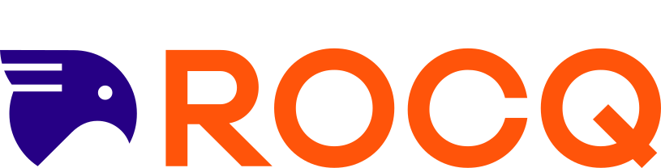

<p align="center">
  
</p>

<p align="center">
  <a href="https://hacspec.zulipchat.com/"></a>
  <a href="https://hax-playground.cryspen.com"></a>
  <a href="https://hax.cryspen.com"></a>
  <a href="https://hax.cryspen.com/blog"></a>
  <a href="LICENSE"></a>
</p>

# hax

hax is a tool for high assurance translations of a large subset of
Rust into formal languages such as [Lean](https://lean-lang.org/),
[F\*](https://www.fstar-lang.org/) or [Rocq](https://rocq-prover.org/).

<p align="center">
    <a href="https://hax-playground.cryspen.com/#fstar+tc/latest-main/gist=5252f86237adbca7fdeb7a8fea0b1648">
    Try out hax online now!
    </a>
</p>

### Supported Backends

<table align="center">
  <tr>
    <td align="center" colspan="3">
      General purpose proof assistants
    </td>
    <td align="center" colspan="3">
      Cryptography & protocols
    </td>
  </tr>
  <tr>
    <td align="center">
      <a href="https://lean-lang.org/">
        <picture>
          <source srcset=".github/assets/lean-dark.svg" media="(prefers-color-scheme: dark)">
          <source srcset=".github/assets/lean-light.svg" media="(prefers-color-scheme: light)">
          
        </picture>
        <br><sub>(via Aeneas)</sub>
      </a>
    </td>
    <td align="center">
      <a href="https://www.fstar-lang.org/">
        F*
      </a>
    </td>
    <td align="center">
      <a href="https://rocq-prover.org/">
        <picture>
          <source srcset=".github/assets/rocq-dark.svg" media="(prefers-color-scheme: dark)">
          <source srcset=".github/assets/rocq-light.svg" media="(prefers-color-scheme: light)">
          
        </picture>
      </a>
    </td>
    <td align="center">
      <a href="https://proverif.inria.fr/">
        <b>ProVerif</b>
      </a>
    </td>
    <td align="center">
      <a href="https://github.com/SSProve/ssprove">
        <picture>
          <source srcset=".github/assets/ssprove-dark.svg" media="(prefers-color-scheme: dark)">
          <source srcset=".github/assets/ssprove-light.svg" media="(prefers-color-scheme: light)">
          
        </picture>
      </a>
    </td>
    <td align="center">
      <a href="https://www.easycrypt.info/">
        <b>EasyCrypt</b>
      </a>
    </td>
  </tr>
  <tr>
    <!-- 🟢🟡🟠🔴 -->
    <td align="center"><sub>🚀 active dev.</sub></td>
    <td align="center"><sub>🟢 stable</sub></td>
    <td align="center"><sub>🟠 experimental</sub></td>
    <td align="center"><sub>🟠 experimental</sub></td>
    <td align="center"><sub>🟠 experimental</sub></td>
    <td align="center"><sub>🟠 experimental</sub></td>
  </tr>
</table>

## Learn more

Here are some resources for learning more about hax:

 - [Manual](https://hax.cryspen.com/manual/index.html) (work in progress)
    + Quick start: [Lean](https://hax.cryspen.com/manual/lean/quick_start/), [F*](https://hax.cryspen.com/manual/fstar/quick_start/)
    + Tutorial: [Lean](https://hax.cryspen.com/manual/lean/tutorial/), [F*](https://hax.cryspen.com/manual/fstar/tutorial/)
 - [Examples](./examples/): a set of examples that show what hax can do for you.
 - Other [specifications](https://github.com/hacspec/specs) of cryptographic protocols.

Questions? Join us on [Zulip](https://hacspec.zulipchat.com/) or open a [GitHub Discussion](https://github.com/cryspen/hax/discussions). For bugs, file an [Issue](https://github.com/cryspen/hax/issues).

## Usage

hax is a cargo subcommand.
The command `cargo hax` accepts the following subcommands:

 * **`into`** (`cargo hax into BACKEND`): translate a Rust crate to the backend `BACKEND`.
 * **`extract`** (`cargo hax extract [NAME...]`): run the proof scenarios declared in `hax.toml`; without names, every scenario in scope runs. See [Proof scenarios](https://hax.cryspen.com/manual/tools/#proof-scenarios) in the manual.
 * **`json`** (`cargo hax json`): extract the typed AST of your crate as a JSON file.
 * **`tools`** (`cargo hax tools SUBCOMMAND`): manage the external tools hax depends on (e.g. Charon and Aeneas). See [Managing tool versions](https://hax.cryspen.com/manual/tools/) in the manual.

### Backends

| Backend               | Command                      | Description                                                                                                                   |
|-----------------------|------------------------------|-------------------------------------------------------------------------------------------------------------------------------|
| **Lean** (via Aeneas) | `cargo hax into lean`        | Recommended for Lean. Uses [Charon](https://github.com/AeneasVerif/charon) + [Aeneas](https://github.com/AeneasVerif/aeneas). |
| Lean (legacy)         | `cargo hax into legacy-lean` | Uses the hax engine directly. Prefer `lean`.                                                                                  |
| F\*                   | `cargo hax into fstar`       | Stable.                                                                                                                       |
| Rocq/Coq              | `cargo hax into coq`         | Experimental.                                                                                                                 |
| ProVerif              | `cargo hax into pro-verif`   | Experimental.                                                                                                                 |
| SSProve               | `cargo hax into ssprove`     | Experimental.                                                                                                                 |
| EasyCrypt             | `cargo hax into easycrypt`   | Experimental.                                                                                                                 |

Use `--help` on any subcommand for options (e.g. `cargo hax into fstar --z3rlimit 100`).

## Installation

hax is supported on Linux (`x86_64` and `aarch64`) and macOS (`aarch64`). Windows is not supported; use [WSL](https://learn.microsoft.com/windows/wsl/) there.

All methods below install hax itself; the target provers (Lean, F\*, ...) must be installed separately (see the [manual](https://hax.cryspen.com/manual/)).

### For the Lean backend

The Lean backend runs the [Charon](https://github.com/AeneasVerif/charon) + [Aeneas](https://github.com/AeneasVerif/aeneas) pipeline instead of the hax engine, so from hax 0.4.0 onwards it needs no other hax component than the `cargo-hax` binary.

Prerequisites: a C compiler and [`rustup`](https://rustup.rs/) (used by Charon at extraction time).

```bash
cargo install --locked cargo-hax
```

`--locked` uses the dependency versions the release was tested with.

To skip that build, use [`cargo-binstall`](https://github.com/cargo-bins/cargo-binstall) to download the binary the release published:

```bash
cargo binstall cargo-hax
```

The binary is the one `cargo install --locked` would produce, built on stable. It needs glibc 2.35 or newer on Linux, and macOS 11 or newer. `cargo binstall` checks neither: it picks the archive from the platform alone, so an older system installs a binary that fails to start; `cargo install --locked cargo-hax` covers those systems. Releases from before 0.4.0 carry no binary at all, and `cargo binstall` falls back to building from source there: pass `--strategies crate-meta-data` to have it fail instead of compiling.

Aeneas and Charon themselves need no install step: hax downloads pre-built binaries on demand. See [Managing tool versions](https://hax.cryspen.com/manual/tools/) in the manual for how they are managed, pinning versions per project, and using your own binaries.

#### From the repository

To use an unreleased version of `cargo-hax`, install it from a checkout:

```bash
git clone https://github.com/cryspen/hax.git && cd hax
cargo install --locked --path cli/cargo-hax
```

#### Pinning hax per project

[`cargo-run-bin`](https://github.com/dustinblackman/cargo-run-bin) can pin hax per project, next to the version of `hax-lib` the project depends on:

```toml
[package.metadata.bin]
# The version of hax to use, matching the `hax-lib` the project depends on.
cargo-hax = { version = "<version>", bins = ["cargo-hax"], locked = true }
```

hax is then invoked as `cargo bin cargo-hax` instead of `cargo hax`, and the pinned version is installed on first use. Running `cargo bin --sync-aliases` once adds an alias to the project's `.cargo/config.toml`, so that the usual `cargo hax` invocation uses the pinned version as well.

### For all backends

The F\*, Rocq/Coq, ProVerif, SSProve, EasyCrypt, and legacy Lean backends need the hax frontend driver and engine as well. Each method below installs everything, including `cargo-hax`:

#### Manual installation

Prerequisites: a C compiler, [`opam`](https://opam.ocaml.org/), [`rustup`](https://rustup.rs/), [`nodejs`](https://nodejs.org/), and [`jq`](https://jqlang.github.io/jq/).

1. Clone this repo: `git clone https://github.com/cryspen/hax.git && cd hax`
2. Create (or use an existing) opam *switch* by running `opam switch create hax 5.4.1`
3. Run the [setup.sh](./setup.sh) script: `./setup.sh`

#### Nix

Prerequisites: the [Nix package manager](https://nixos.org/) with [flakes](https://wiki.nixos.org/wiki/Flakes) enabled, e.g. installed via the [Determinate Nix Installer](https://github.com/DeterminateSystems/nix-installer).

Install hax with `nix profile install github:cryspen/hax`.

Alternatively, run hax on a crate without installing it (from the crate's folder): `nix run github:cryspen/hax -- into <backend>`. To speed up builds with the [hax binary cache](https://app.cachix.org/cache/hax), run `cachix use hax`.

#### Docker

Prerequisites: [Docker](https://docs.docker.com/get-started/get-docker/).

1. Clone this repo: `git clone https://github.com/cryspen/hax.git && cd hax`
2. Build the docker image: `docker build -f .docker/Dockerfile . -t hax`
3. Get a shell: `docker run -it --rm -v /some/dir/with/a/crate:/work hax bash`

Inside the container, hax is invoked as `cargo-hax` instead of `cargo hax`.

## Supported Subset of the Rust Language

hax intends to support full Rust, with one exception that promotes a functional style: mutable references (aka `&mut T`) are forbidden on return types and when aliasing (see https://github.com/cryspen/hax/issues/420).

Each unsupported Rust feature is documented as an issue labeled [`unsupported-rust`](https://github.com/cryspen/hax/issues?q=is%3Aissue+is%3Aopen+label%3Aunsupported-rust). When the issue is labeled [`wontfix-v1`](https://github.com/cryspen/hax/issues?q=is%3Aissue+is%3Aopen+label%3Aunsupported-rust+label%3Awontfix%2Cwontfix-v1), that means we don't plan on supporting that feature soon.

Quicklinks:
 - [🔨 Rejected rust we want to support](https://github.com/cryspen/hax/issues?q=is%3Aissue+is%3Aopen+label%3Aunsupported-rust+-label%3Awontfix%2Cwontfix-v1);
 - [💭 Rejected rust we don't plan to support in v1](https://github.com/cryspen/hax/issues?q=is%3Aissue+is%3Aopen+label%3Aunsupported-rust+label%3Awontfix%2Cwontfix-v1).

## Publications & Other material

* [📕 Tech report](https://hal.inria.fr/hal-03176482)
* [📕 HACSpec: A gateway to high-assurance cryptography](https://github.com/hacspec/hacspec/blob/master/rwc2023-abstract.pdf)
* [📕 Original hacspec paper](https://www.franziskuskiefer.de/publications/hacspec-ssr18-paper.pdf)

### Secondary literature, using hacspec:
* [📕 Last yard](https://eprint.iacr.org/2023/185)
* [📕 A Verified Pipeline from a Specification Language to Optimized, Safe Rust](https://github.com/hacspec/hacspec.github.io/blob/master/coqpl22-final61.pdf) at [CoqPL'22](https://popl22.sigplan.org/details/CoqPL-2022-papers/5/A-Verified-Pipeline-from-a-Specification-Language-to-Optimized-Safe-Rust)
* [📕 Hax - Enabling High Assurance Cryptographic Software](https://github.com/hacspec/hacspec.github.io/blob/master/RustVerify24.pdf) at [RustVerify24](https://sites.google.com/view/rustverify2024)
* [📕 A formal security analysis of Blockchain voting](https://github.com/hacspec/hacspec.github.io/blob/master/coqpl24-paper8-2.pdf) at [CoqPL'24](https://popl24.sigplan.org/details/CoqPL-2024-papers/8/A-formal-security-analysis-of-Blockchain-voting)
* [📕 Specifying Smart Contract with Hax and ConCert](https://github.com/hacspec/hacspec.github.io/blob/master/coqpl24-paper9-13.pdf) at [CoqPL'24](https://popl24.sigplan.org/details/CoqPL-2024-papers/9/Specifying-Smart-Contract-with-Hax-and-ConCert)

## Contributing

Before starting any work please join the [Zulip chat][chat-link], start a [discussion on Github](https://github.com/cryspen/hax/discussions), or file an [issue](https://github.com/cryspen/hax/issues) to discuss your contribution. The contribution guidelines are described in [CONTRIBUTING.md](./CONTRIBUTING.md), including the [development setup](./CONTRIBUTING.md#development), the structure of the repository, and the build commands.


[chat-link]: https://hacspec.zulipchat.com

## Acknowledgements

[Zulip] graciously provides the hacspec & hax community with a "Zulip Cloud Standard" tier.


[Zulip]: https://zulip.com/
